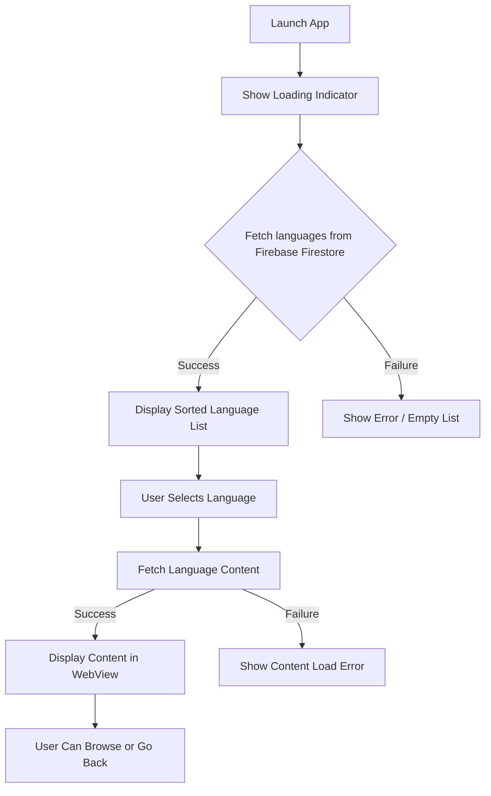

# First Run & Validation

Welcome to the critical step of getting your LearnXinYMinutesUnofficialAndroid app up and running. This guide leads you through launching the app for the first time, verifying that core functionalities are working correctly, and recognizing key success indicators in the user interface. By following these steps, you will confidently validate your installation and configuration before diving into your language reference browsing experience.

---

## 1. Launching the App for the First Time

Begin by opening the Learn X in Y Minutes app on your device or emulator. This initial launch will connect to Firebase Firestore to retrieve the list of supported programming languages.

### Step-by-step:

1. **Open the App**
   - Locate the app icon labeled "Learn X in Y Minutes" on your Android device or emulator.
   - Tap the icon to start the app.

2. **Observe the Loading Indicator**
   - Upon launch, you should see a progress indicator (spinner or progress bar) as the app fetches language data from Firebase.

3. **Wait for Language List to Appear**
   - After loading, a list of programming languages will appear in alphabetical order.

<Tip>
If the list does not load or the progress indicator remains indefinitely, check your internet connection. The app requires network access on first run to fetch Firestore data.
</Tip>

---

## 2. Validating Core User Interface Elements

Once the language list is visible, your app is correctly connected to Firebase and ready for use.

Check the following UI elements for proper functioning:

- **Search Bar Visibility**: A search icon is present in the top menu bar.
- **Language List Interactivity**: Tap on any language name to navigate to that language's content page.
- **Menu Options**: Open the menu and verify that "About" and "Visit the XinY site" options are available.

### Verifying language selection:

1. Tap any language entry.
2. The app navigates to a detailed view showing the language reference.
3. Confirm you see the formatted content load inside the WebView with a loading spinner disappearing once content is ready.

<Tip>
Use the back button to return from the detailed language view to the main language list.
</Tip>

---

## 3. Recognizing Successful Operation Indicators

Your app is functioning correctly when:

- The language list appears within a few seconds on app start.
- Search filtering works smoothly as you type.
- Selected language displays its content without delay or error.
- The "About this app" dialog opens when accessed from the menu.
- The "Visit the XinY site" menu option launches a browser with the official Learn X in Y Minutes website.

<Check>
If all above behaviors occur, your initial run and validation are successful.
</Check>

---

## 4. Troubleshooting Common Issues

Encountering problems during your first run is normal during onboarding. Most can be resolved quickly:

<AccordionGroup title="Troubleshooting First Run Issues">
<Accordion title="App Shows Empty List or Stuck on Loading">
- Verify device/emulator internet connectivity.
- Restart the app to trigger data fetch again.
- Check that Firebase configuration (`google-services.json`) is correctly placed.
- Confirm Firestore has data in the "languages" collection if running locally.
</Accordion>
<Accordion title="Search Bar Does Not Appear or Filter Does Not Work">
- Confirm the search icon is present in the top options menu.
- Tap the search icon to toggle the search bar visibility.
- Typing should filter the list in real-time; if it doesn't, restart the app.
</Accordion>
<Accordion title="Language Content Does Not Load After Selection">
- Ensure your device has network access.
- Refresh the app or retry selecting the language.
- Check for any error logs if developing locally.
</Accordion>
<Accordion title="Menu Options Are Missing or Unresponsive">
- Make sure the app theme and menu resources loaded correctly.
- Restart the app to refresh UI.
- If errors persist, ensure you have the correct version installed.
</Accordion>
</AccordionGroup>

<Warning>
If problems persist despite troubleshooting, consult the Troubleshooting Common Issues documentation or your development environment logs for deeper diagnosis.
</Warning>

---

## 5. Summary Flow Diagram of the First Run

This flow visually captures what happens during your first run and how validation steps align with app responses.

---

## 6. Next Steps

After successful validation, you can proceed with:

- Exploring additional features like offline caching and bookmarking.
- Customizing app settings in the configuration stage if needed.
- Reviewing the Troubleshooting Common Issues page for nuanced error resolution.
- Consult the Key Features & Benefits page to learn tips for efficient usage.

**Congratulations! You have validated that your LearnXinYMinutesUnofficialAndroid app is running as intended and ready to support your quick language reference needs.**

---

## Additional Resources

- [Prerequisites & System Requirements](/getting-started/setup-installation/prerequisites-requirements) — Ensure your environment matches app needs.
- [Installing the App](/getting-started/setup-installation/installation-instructions) — How to install and deploy the app.
- [Configuration & Firebase Setup](/getting-started/setup-installation/configuration-setup) — Setting up connection to Firebase.
- [Troubleshooting Common Issues](/getting-started/setup-installation/troubleshooting-common-issues) — Quickly resolve related problems.

For further information, consider visiting the official [Learn X in Y Minutes site](https://learnxinyminutes.com/) and the app's [GitHub repository](https://github.com/modelorona/LearnXinYMinutesUnofficalAndroidApp).

---

_End of First Run & Validation Documentation._