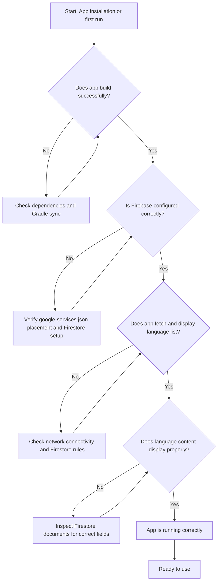

# Troubleshooting Common Issues

When installing or running the LearnXinYMinutesUnofficialAndroid app for the first time, you might encounter a few common issues that can prevent smooth onboarding. This guide helps you quickly identify and resolve these problems, focusing on dependency conflicts, Firebase configuration errors, and emulator or device compatibility quirks.

---

## 1. Dependency and Build Issues

### Problem: Build Fails or Dependencies Don’t Sync

**Symptoms:**
- Gradle sync errors in Android Studio
- Missing classes or libraries, especially related to Firebase or UI components
- Compilation failures citing unresolved references

**Resolution Steps:**
1. **Verify your Android Studio version** matches the recommended version for the project.
2. Open the project and select **File > Sync Project with Gradle Files**.
3. If sync errors persist, check the `build.gradle` files for:
   - Correct versions for Firebase, Play Services, and other third-party libraries.
   - Network connectivity, as Gradle may need to download dependencies.
4. Run a clean build:

   ```bash
   ./gradlew clean build
   ```

5. If ProGuard or R8 minification issues occur, ensure your `proguard-rules.pro` includes the rules provided, especially the lines preserving resource classes and logging exceptions.

<Tip>
Gradle sync and build failures often stem from outdated dependency versions or transient network issues. Refresh, clean, and verify versions before deeper debugging.
</Tip>

---

## 2. Firebase Firestore Configuration Issues

### Problem: App Crashes or Fails to Fetch Language Data

**Symptoms:**
- App shows a loading spinner indefinitely.
- Logcat reveals Firebase initialization errors or permission denied exceptions.
- Language list or content does not populate.

**Resolution Steps:**
1. **Verify `google-services.json` placement:**
   - Ensure the file is located under the module-level `app/` directory.
2. **Check Firebase project setup:**
   - Confirm Firestore is enabled in the Firebase console.
   - Permissions and security rules should allow reads to the `languages` collection.
3. **Verify Firestore persistence settings:**
   - The app enables offline persistence explicitly; if issues appear, disabling and re-enabling persistence can help.

   ```java
   FirebaseFirestoreSettings settings = new FirebaseFirestoreSettings.Builder()
       .setPersistenceEnabled(true)
       .build();
   db.setFirestoreSettings(settings);
   ```

4. **Network connectivity:**
   - Validate device or emulator has Internet access during first sync.
5. **Check Logcat:**
   - Search for errors tagged with `XINY TASK ERROR` to find Firebase fetch failures.

<Warning>
Misconfigured `google-services.json` or incorrect Firestore rules are the most frequent causes of runtime Firebase errors.
</Warning>

---

## 3. Emulator and Device Compatibility

### Problem: App Crashes or UI Fails to Load on Emulator or Physical Device

**Symptoms:**
- App crashes on startup
- Blank screens or unresponsive UI
- Inability to open URLs from the app’s About or Visit menu

**Resolution Steps:**
1. **Use a supported Android version:** The app targets Android SDK versions compatible with API 21+.
2. **Grant Internet permission:** The AndroidManifest.xml includes `android.permission.INTERNET`; ensure emulator or device allows network access.
3. **Clear app data or reinstall:** Sometimes stale caches cause UI/loading issues.
4. **Test on physical device:** Some emulators lack full network capabilities impacting Firebase reads.
5. **Check WebView performance:** Language content is displayed in a WebView; ensure WebView is up to date on the device.

<Note>
If links from the app (e.g., ‘Visit the XinY site’) fail, verify that the device’s default browser is installed and working.
</Note>

---

## 4. Common Error Messages and Their Meanings

| Error Message                         | Cause                                              | Resolution                          |
|-------------------------------------|----------------------------------------------------|-----------------------------------|
| `Failed to fetch languages`         | Firestore data fetch failed                         | Check Firebase config and network |
| `FirebaseFirestoreException: PERMISSION_DENIED` | Firestore rules are restrictive          | Adjust Firestore security rules     |
| `NullPointerException` on Language List | Data not loaded before UI access                  | Ensure async data load completes   |
| `WebView loading blank page`        | HTML content missing or load error                  | Confirm Firestore documents have `html` field |

---

## 5. Diagnostic and Debugging Tips

- **Use Android Studio Logcat:** Filter by tags like `XINY TASK ERROR` for Firebase-specific issues.
- **Enable Firebase Debug Logging:**
  
  Add this line before initialization:

  ```java
  FirebaseFirestore.setLoggingEnabled(true);
  ```

- **Manually inspect Firestore data:** Confirm documents exist in `languages` collection with `language` and `html` fields.
- **Test network access:** Open `https://learnxinyminutes.com/` in device browser to validate connection.

---

## 6. When to Seek Support

If you have completed these troubleshooting steps without resolving your issue, consider:
- Reviewing the [Installation Instructions](./installation-instructions) and [Configuration & Firebase Setup](./configuration-setup) pages for missed steps.
- Consulting the [First Run & Validation](./first-run-validation) guide for UI and functional checks.
- Opening an issue on the [GitHub repository](https://github.com/modelorona/LearnXinYMinutesUnofficalAndroidApp) with relevant logs and error details.

---

## Appendix: Quick Checklist for First Runs

- [x] `google-services.json` is properly placed and valid
- [x] Internet permission granted (in manifest and on device/emulator)
- [x] Android Studio dependencies synced without errors
- [x] Firebase Firestore project is correctly configured and accessible
- [x] App runs without crashes; language list loads and displays
- [x] Clicking a language shows formatted content
- [x] About and external link menus work

---

This troubleshooting guide is designed to help you overcome typical startup challenges for LearnXinYMinutesUnofficialAndroid. Following these steps will get you back on track swiftly and maximize your productive learning experience.


---

### Relevant Links
- [Installation Instructions](./installation-instructions) — Guide to install and set up the project
- [Configuration & Firebase Setup](./configuration-setup) — Details on connecting to Firebase
- [First Run & Validation](./first-run-validation) — Confirm the app is working as expected
- [System Architecture & Core Concepts](../../overview/system-architecture-and-concepts/architecture-diagram) — Understanding how components interact
- [GitHub Repository](https://github.com/modelorona/LearnXinYMinutesUnofficalAndroidApp) — Source code and issue tracking

---

### Diagram: Troubleshooting Flow Overview

