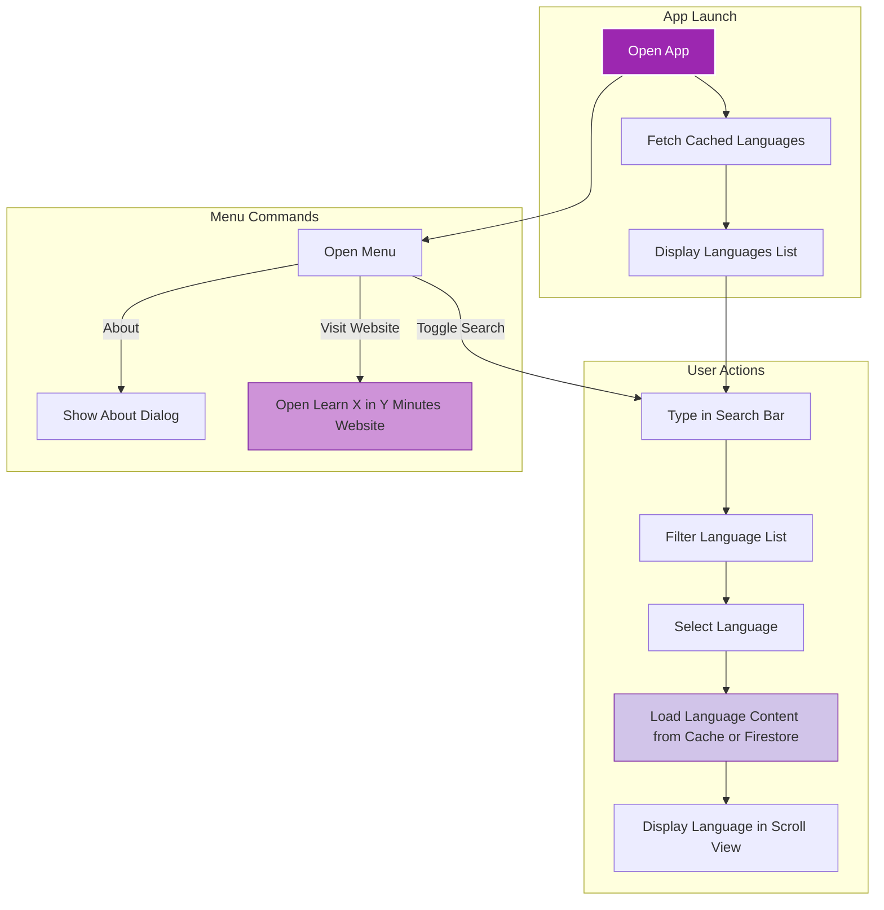

# Key Features & Benefits

Explore the core capabilities of LearnXinYMinutesUnofficialAndroid that make it a fast, reliable, and intuitive tool for developers, students, and professionals looking to review programming languages on the go. This page highlights how the app’s design supports efficient learning and why these features matter for your productivity.

---

## Unlock Quick Access to Programming Language References

The LearnXinYMinutesUnofficialAndroid app brings the rich content of the popular Learn X in Y Minutes website straight to your Android device. With streamlined features focused on ease-of-use and offline accessibility, it empowers you to refresh your knowledge anytime without friction.

### Core Features at a Glance

- **Offline-Friendly Browsing**: Once fetched, language files are cached on your device, enabling uninterrupted access even without an internet connection. This ensures you can study or reference code in environments with limited or no connectivity.
- **Dynamic Search & Filter**: The intuitive search bar filters languages as you type, helping you find your desired programming language instantly from a comprehensive list.
- **Simple, Scrollable Language Views**: Each language example loads in a scrollable web view optimized for readability, allowing you to digest complex concepts at your own pace.
- **Direct Link to Official Content**: Easily visit the official Learn X in Y Minutes site via menu options to explore additional languages or updated versions, keeping you connected to the source material.
- **Minimalist, Responsive UI**: A clean, uncluttered interface keeps focus on the content, reducing distractions and accelerating your learning flow.

## Why These Features Matter

When you need a quick refresher on syntax or language constructs, speed and accessibility are essential. LearnXinYMinutesUnofficialAndroid eliminates delays by pre-loading and caching language references, so you don’t face lag or downtime. The search feature respects your time by narrowing choices in real-time. Meanwhile, the readable language display lets you scan through essentials effortlessly.

Together, these features empower you to stay sharp, whether preparing for an interview, coding on a client site, or simply brushing up between projects.

## How These Features Work Together

Imagine you're commuting with intermittent internet. You launch the app and find your target language using the search bar within seconds. Thanks to offline caching, the language content loads immediately, letting you study code examples without a hitch. Want to cross-check with the official Learn X in Y Minutes website? Just tap the menu link to open it in your browser.

This cohesive feature set transforms your phone into a powerful, portable programming refresher.

## Practical Tips to Maximize Benefit

- **Search Early**: Use the search bar immediately to narrow down your language list — saves scrolling time.
- **Launch Languages While Online**: Open languages at least once with an internet connection to cache their content for offline use.
- **Utilize Menu Options**: Explore app info or jump to the official website from the menu to deepen your knowledge or contribute feedback.
- **Watch for Progress Indicators**: When loading languages, wait for the progress bars to disappear for a smooth experience.

## Common Pitfalls & How to Avoid Them

- **No Initial Language Content**: If opening a language for the first time while offline, the content won’t load. Ensure an internet connection for the first access.
- **Search Bar Visibility**: The search bar toggles visibility via the menu's search icon. If you don't see it, tap the magnifying glass in the top menu.
- **Slow Internet**: Initial language list loading depends on your connection—allow a few seconds if loading is slow.

---

## Summary

The app delivers a frictionless experience balancing performance and usability, turning your Android device into a rapid-access programming language guide. Its offline capabilities and seamless navigation accelerate your learning and review workflow, saving time and enabling success.

For more detailed information, explore related sections like the [Product Introduction](/overview/introduction-and-value/product-introduction) and [Audience & Use Cases](/overview/introduction-and-value/audience-and-use-cases).

---

## Getting Started Preview

To begin using these key features:

1. Open the app with an internet connection to load and cache available languages.
2. Use the search bar (accessible via the top menu) to quickly find a language.
3. Tap a language to view its example code and explanation in a scrollable format.
4. Access the menu to visit the official Learn X in Y Minutes site or read about the app.

For detailed steps and troubleshooting, see the [Setup & Installation](/getting-started/setup-installation/prerequisites-requirements) documentation.

---

## Visual Overview

---

For source code references or further technical exploration, visit the GitHub repository at [LearnXinYMinutesUnofficalAndroid](https://github.com/modelorona/LearnXinYMinutesUnofficalAndroid).

